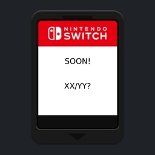
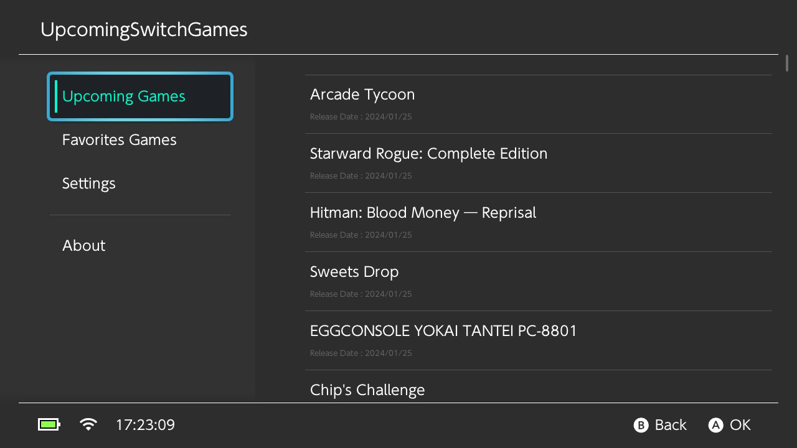
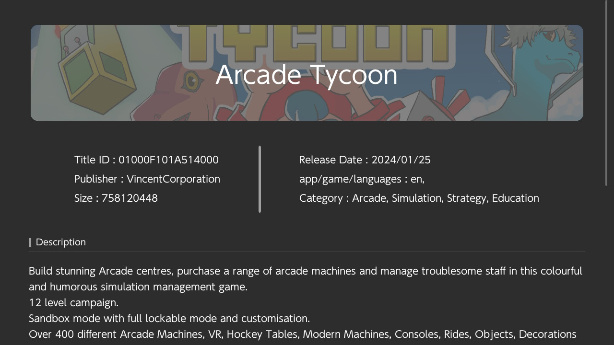
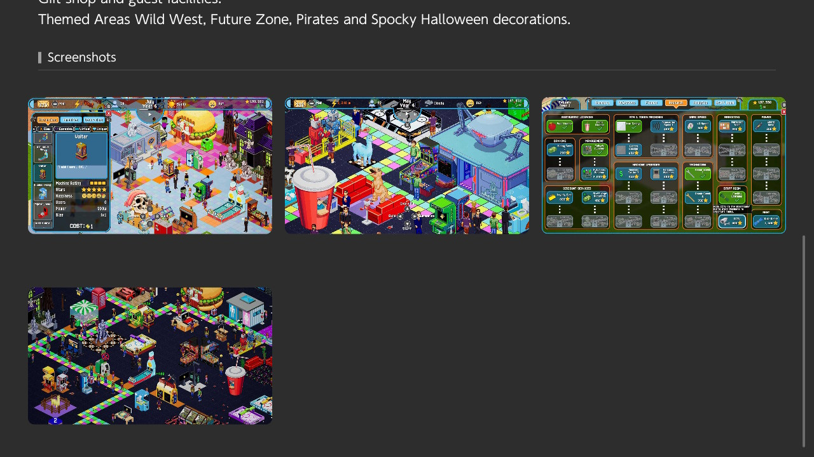
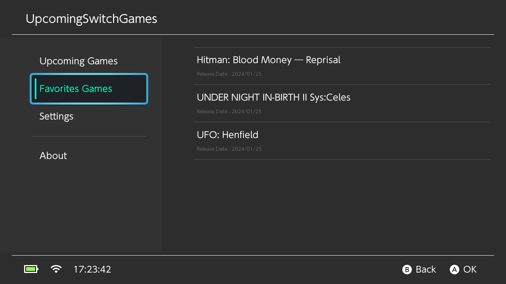

<div align="center">
    <h1>SimpleModDownloader</h1>
    <p>A Switch homebrew that allows you to see upcoming games on the Switch</p>
    <a rel="IMAGE">
        
    </a>
</div>

<p>

<p align="center">
    <a rel="LICENSE" href="https://github.com/PoloNX/SimpleModDownloader/blob/master/LICENSE">
        
    </a>
    <a rel="VERSION" href="https://github.com/PoloNX/UpcomingSwitchGames">
        
    </a>
</p>

---

- [Screenshot](#screenshot)
- [How to build](#how-to-build)
- [Help me](#help-me)
- [Credits](#credits)


## Screenshot



<details>
  <summary><b>More Screenshots</b></summary>





</details>

## How to build

### Requirements

- [cmake](https://cmake.org/)
- [devkitPro](https://devkitpro.org/wiki/Getting_Started)

### Build

```bash
git clone --recursive https://github.com/PoloNX/UpcomingSwitchGames/
cd UpcomingSwitchGames
cmake -B cmake-build-switch -G Ninja -DPLATFORM_SWITCH=ON -DCMAKE_BUILD_TYPE=Release 
cmake --build cmake-build-switch --target UpcomingSwitchGames.nro
```

## Help me

If you want to help me open an issue when you encounter a bug and a pull request if you have a fix.

## Credits 

- Thanks to [Natinusala](https://github.com/natinusala) and [xfangfang](https://github.com/xfangfang) for [borealis](https://github.com/xfangfang/borealis)
- Thanks to [xfangfang](https://github.com/xfangfang) for tour help with borealis
- Thanks to [blawar](https://github.com/blawar) for titleDB
